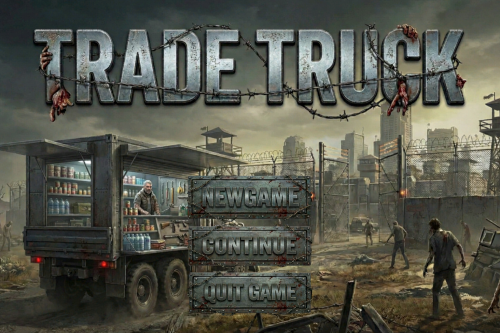
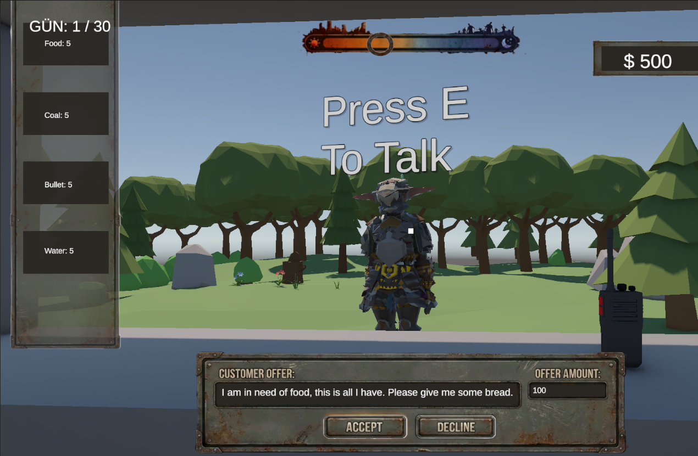
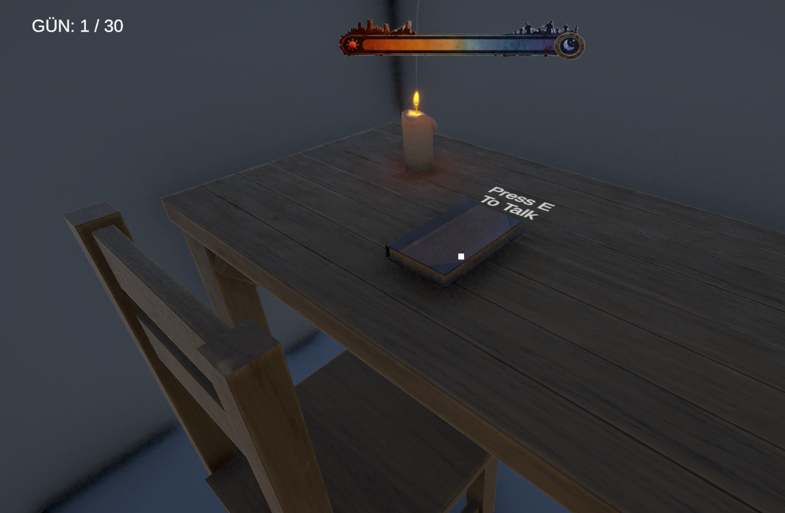
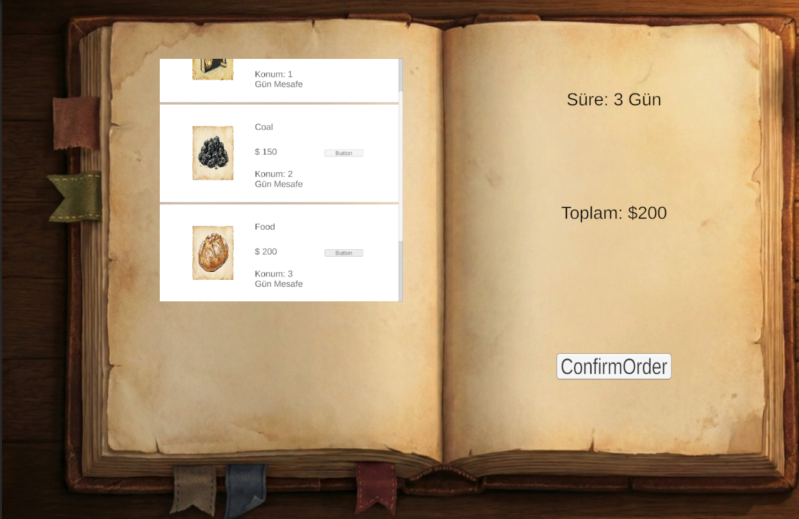
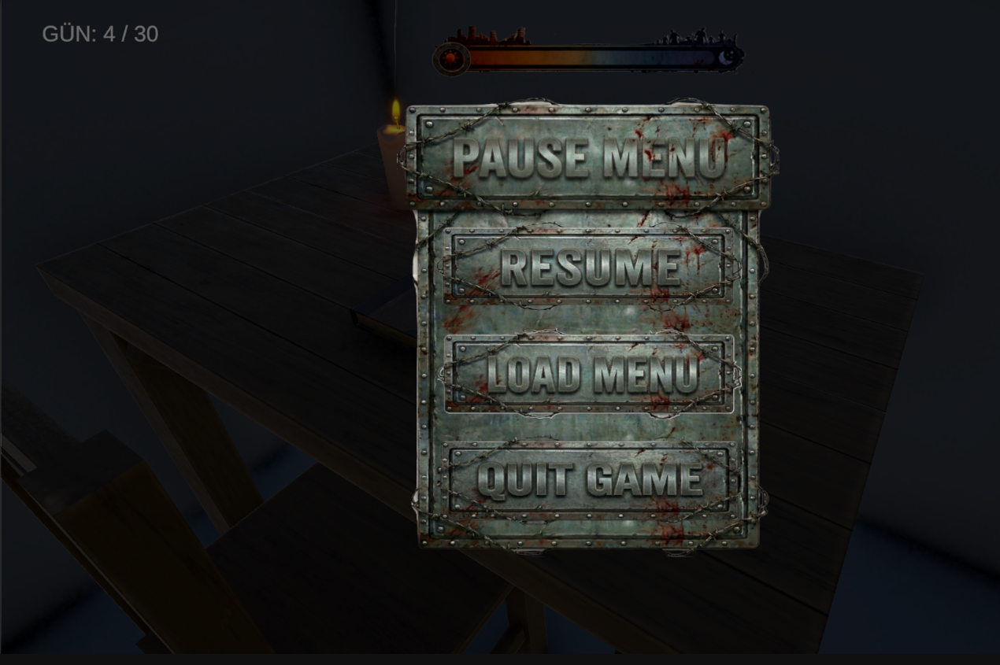

  <h1>TradeTruck</h1>
  
  

    <strong>Navigate. Trade. Survive.</strong>
  

  

    
    
    
    
  

   
  
  > 🚧 **Work in Progress:** This project is currently in active development. Features and mechanics are subject to change and improvement.

---

## 📖 About The Project

**TradeTruck** is a 3D simulation and management game set in a post-apocalyptic world. Developed for PC using the powerful **Unity 6 Engine**, the game focuses on the logistics of survival.

In a fractured world where resources are scarce, you manage a transport truck—the only connection between isolated survivor camps. Instead of direct driving, players focus on strategic route planning, inventory management, and maximizing profits. You are the economy's backbone, deciding what resources go where while keeping your mobile base operational.

### Key Features
* **📦 Logistics & Management:** Oversee the truck's status, fuel, and cargo capacity. Every slot in your inventory matters.
* **💰 Dynamic Economy System:** A simulated market where prices fluctuate based on supply and demand across different camps.
* **🔄 Day/Night Cycle:** Time management is crucial. The world changes dynamically, affecting travel times and camp availability.

---

## 📸 Screenshots

| | |
| :---: | :---: |
|  |  |

| | | |
| :---: | :---: | :---: |
|  |  |  |

---

## 💻 Technical Details

This project is built to leverage the latest rendering and processing capabilities of Unity 6.

* **Engine:** Unity 6000.0.58f2
* **Language:** C#
* **Platform:** PC (Windows)
* **Graphics:** 3D Environment with dynamic lighting.
* **Core Systems:** Custom-built Economy Manager and Day/Night Controller.
